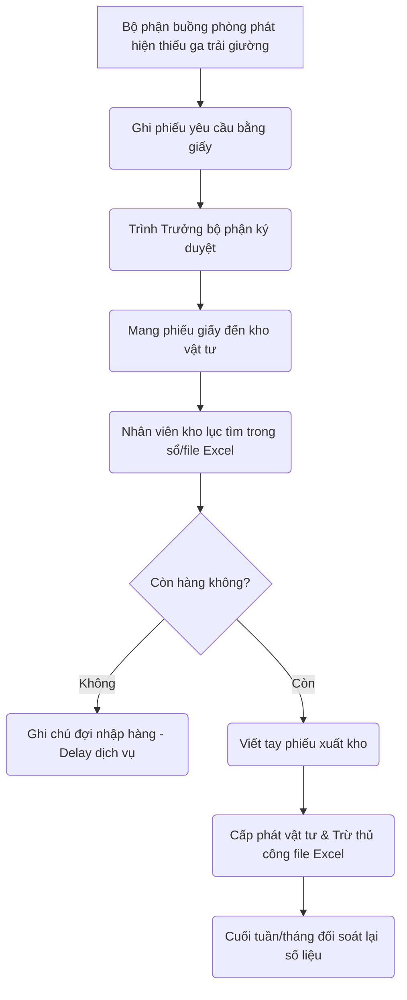
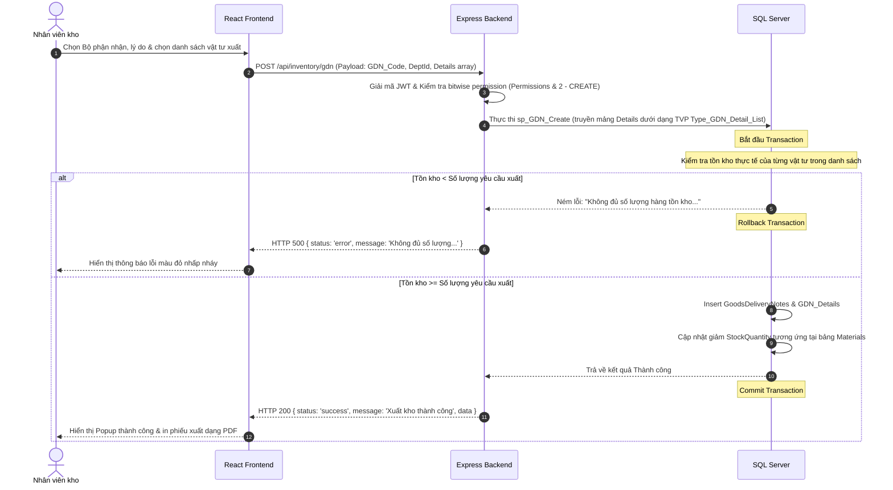
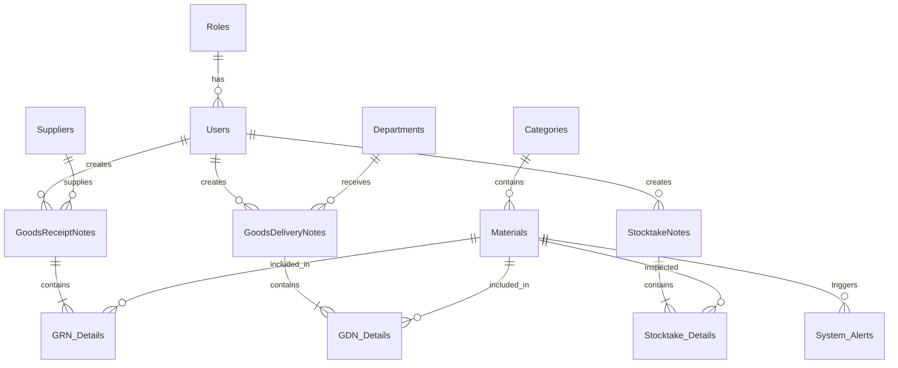

# BÁO CÁO HỌC PHẦN: PHÁT TRIỂN ỨNG DỤNG WEB

---

## **TRƯỜNG ĐẠI HỌC LẠC HỒNG**
### **KHOA CÔNG NGHỆ THÔNG TIN**

<br/>
<br/>

<div align="center">
  
  # **BÁO CÁO KẾT THÚC HỌC PHẦN**
  # **PHÁT TRIỂN ỨNG DỤNG WEB**
  
  ## **HỆ THỐNG QUẢN LÝ CƠ SỞ VẬT TƯ KHÁCH SẠN (NOVA SPHERE HOTEL & INVENTORY)**
  
  ### *Định hướng phát triển bằng phương pháp luận Vibe Coding*
  
</div>

<br/>
<br/>
<br/>

* **Giảng viên hướng dẫn:** ThS. Giảng Viên Quản Lý
* **Nhóm sinh viên thực hiện:** Nhóm LHU-VibeWeb-Hotel
* **Thành viên nhóm:**
  1. Nguyễn Văn A (MSSV: 20110001)
  2. Trần Thị B (MSSV: 20110002)
  3. Lê Hoàng C (MSSV: 20110003)
* **Lớp:** 22CN111

<br/>
<br/>
<div align="center">
  
  **BÌNH HÒA, ĐỒNG NAI – NĂM 2026**
  
</div>

---
*Trang 2*

<br/>

## **MỤC LỤC BÁO CÁO**

### **CHƯƠNG 1: KHẢO SÁT HỆ THỐNG VÀ XÁC ĐỊNH YÊU CẦU CHI TIẾT**
* 1.1. Lý do hình thành dự án và bối cảnh thực tiễn.......................................................................Trang 4
* 1.2. Mục tiêu chiến lược và phạm vi của hệ thống........................................................................Trang 5
* 1.3. Khảo sát hiện trạng và quy trình nghiệp vụ thủ công...............................................................Trang 6
* 1.4. Phân tích yêu cầu chức năng từ các góc độ tác nhân..............................................................Trang 7
* 1.5. Các ràng buộc về yêu cầu phi chức năng nghiêm ngặt............................................................Trang 8

### **CHƯƠNG 2: PHÂN TÍCH VÀ THIẾT KẾ KIẾN TRÚC TOÀN DIỆN**
* 2.1. Lựa chọn kiến trúc công nghệ và giải pháp mô hình 3 lớp......................................................Trang 9
* 2.2. Thiết kế mô hình hóa Use Case và đặc tả chi tiết kịch bản.....................................................Trang 10
* 2.3. Thiết kế Cơ sở dữ liệu quan hệ (Entity Relationship Diagram).................................................Trang 11
* 2.4. Thiết kế giao diện UI/UX và luồng trải nghiệm người dùng.....................................................Trang 13

### **CHƯƠNG 3: PHƯƠNG PHÁP LUẬN VÀ HIỆN THỰC HÓA BẰNG VIBE CODING**
* 3.1. Khái niệm và tư duy phát triển phần mềm theo định hướng Vibe Coding...............................Trang 14
* 3.2. Thiết lập môi trường và cấu hình các AI Agent phụ trợ..........................................................Trang 15
* 3.3. Nhật ký kỹ thuật Prompting chi tiết và thực tế mã nguồn sinh ra..............................................Trang 16
* 3.4. Quá trình kiểm thử, Debug và tối ưu hóa hệ thống bằng AI....................................................Trang 19

### **CHƯƠNG 4: ĐÁNH GIÁ THỰC NGHIỆM, TỔNG KẾT VÀ HƯỚNG ĐI TƯƠNG LAI**
* 4.1. Đánh giá kết quả đạt được đối chiếu với cam kết ban đầu......................................................Trang 21
* 4.2. Bài học kinh nghiệm trong quản trị mã nguồn và phân phối công việc........................................Trang 22
* 4.3. Đề xuất cải tiến và lộ trình nâng cấp hệ thống thông minh.......................................................Trang 23

---
*Trang 3*

<br/>

## **CHƯƠNG 1: KHẢO SÁT HỆ THỐNG VÀ XÁC ĐỊNH YÊU CẦU CHI TIẾT**

### **1.1. Lý do hình thành dự án và bối cảnh thực tiễn**
Sự bùng nổ của ngành du lịch và lưu trú cao cấp đặt ra những thách thức lớn đối với công tác vận hành của các khách sạn quy mô vừa và lớn. Một trong những yếu tố ảnh hưởng trực tiếp đến chất lượng dịch vụ và chi phí vận hành chính là khâu quản lý cơ sở vật chất, trang thiết bị và vật tư tiêu hao (Amenities, Linen, hóa chất tẩy rửa, đồ uống minibar,...).

Tại các khách sạn chưa áp dụng hệ thống chuyển đổi số tập trung, việc quản lý vật tư thường bộc lộ những lỗ hổng nghiêm trọng:
* **Thất thoát lớn:** Vật tư tiêu hao cấp phát cho các bộ phận (Buồng phòng, Nhà hàng - F&B, Kỹ thuật) không được đối soát chặt chẽ dẫn đến tình trạng mất mát hoặc sử dụng lãng phí.
* **Độ trễ thông tin cao:** Bộ phận Buồng phòng khi cần khăn, ga giường hoặc xà bông phải gọi điện hoặc làm phiếu giấy gửi tới kho. Nhân viên kho kiểm tra thủ công, viết phiếu xuất rồi mới giao hàng. Quy trình này gây mất thời gian và giảm hiệu suất phục vụ khách lưu trú.
* **Mất cân đối tồn kho:** Việc thiếu cảnh báo tồn kho tối thiểu dẫn đến hai trạng thái cực đoan: hoặc hết hàng đột xuất (gây gián đoạn dịch vụ), hoặc tích trữ quá nhiều hàng cận date (gây giam dòng vốn lưu động).
* **Thiếu Audit Trail:** Khi xảy ra chênh lệch số liệu kiểm kê thực tế và sổ sách, quản trị viên rất khó phát hiện ra sai sót nằm ở khâu nào (nhập kho, xuất kho hay do hao hụt tự nhiên) vì thiếu lịch sử chỉnh sửa rõ ràng.

Từ nhu cầu cấp thiết đó, dự án **"Hệ thống Quản lý cơ sở vật tư khách sạn (Nova Sphere Hotel & Inventory)"** ra đời. Đây là một giải pháp toàn diện giúp tự động hóa toàn bộ luồng nghiệp vụ quản lý tài sản, vật tư theo thời gian thực, tối ưu hóa công tác cấp phát và nâng cao tính minh bạch trong vận hành khách sạn.

---
*Trang 4*

<br/>

### **1.2. Mục tiêu chiến lược và phạm vi của hệ thống**

#### **Mục tiêu chiến lược:**
* Xây dựng một nền tảng Web quản lý tập trung toàn bộ danh mục tài sản và vật tư của khách sạn Nova Sphere.
* Đảm bảo tính toàn vẹn dữ liệu ở mức độ cao nhất thông qua việc đóng gói toàn bộ logic nghiệp vụ (business logic) vào lớp **Stored Procedures** tại cơ sở dữ liệu SQL Server.
* Tự động hóa quy trình nhập/xuất kho bằng các giao dịch an toàn (Database Transactions), ngăn ngừa triệt để các tình trạng tranh chấp tài nguyên (Race Condition) và sai lệch số lượng hàng tồn.
* Tích hợp Dashboard phân tích dữ liệu thời gian thực (Real-time Analytics) và các cảnh báo thông minh bằng AI về tình trạng tồn kho dưới hạn mức an toàn hoặc hàng tồn đọng lâu ngày không sử dụng.

#### **Phạm vi hệ thống:**
Hệ thống được thiết kế để giải quyết triệt để 5 khối nghiệp vụ cốt lõi sau:
1. **Quản lý danh mục nền tảng:** Quản lý Loại vật tư (Categories), Nhà cung cấp (Suppliers), Bộ phận nhận hàng (Departments) và Danh mục Vật tư chi tiết (Materials).
2. **Quản lý nhập kho (Goods Receipt Note - GRN):** Lập phiếu nhập kho từ nhà cung cấp, hỗ trợ truyền mảng danh sách chi tiết nhiều vật tư đồng thời (Table-Valued Parameter), tính toán đơn giá và tự động tăng tồn kho.
3. **Quản lý xuất kho (Goods Delivery Note - GDN):** Lập phiếu xuất cấp phát vật tư cho các bộ phận khách sạn, tự động kiểm tra số lượng tồn thực tế trước khi xuất hàng và tự động giảm trừ tồn kho.
4. **Kiểm kê kho (Stocktake):** Tạo phiếu kiểm kê định kỳ, tính toán chênh lệch giữa số lượng thực tế đếm được và số lượng hệ thống ghi nhận, cập nhật cân bằng kho kèm nhật ký ghi chú người chỉnh sửa.
5. **Cảnh báo & Báo cáo thông minh (AI & WebSockets):** Thống kê dòng lưu chuyển vật tư nhập/xuất theo thời gian thực dưới dạng biểu đồ trực quan; tự động quét phát hiện vật tư chạm ngưỡng tối thiểu để bắn thông báo lập tức qua kết nối thời gian thực.

---
*Trang 5*

<br/>

### **1.3. Khảo sát hiện trạng và quy trình nghiệp vụ thủ công**

Qua khảo sát thực tế quy trình quản lý vật tư thủ công tại khách sạn Nova Sphere trước đây, nhóm nghiên cứu nhận thấy luồng công việc gặp phải nhiều nút thắt cổ chai về mặt thời gian và độ chính xác:



#### **Những lỗ hổng nghiêm trọng từ quy trình cũ:**
* **Thiếu tính đồng bộ:** Dữ liệu tồn kho nằm trên các file Excel cục bộ của thủ kho. Trưởng bộ phận buồng phòng hay ban quản lý khách sạn không thể biết được lượng hàng thực tế trong kho còn bao nhiêu để chủ động sắp xếp công việc, dẫn đến việc thụ động khi có đoàn khách lớn đột xuất.
* **Thời gian xử lý kéo dài:** Một quy trình xin cấp phát vật tư tiêu hao từ lúc phát sinh đến lúc nhận hàng thực tế tốn trung bình từ 30 - 45 phút do phải luân chuyển các biểu mẫu giấy tờ và ký duyệt thủ công.
* **Sai sót dữ liệu khi nhập liệu thủ công:** Việc cộng/trừ số lượng xuất nhập cuối ngày bằng tay dễ phát sinh nhầm lẫn giữa các mã hàng có tên gọi gần giống nhau (ví dụ: Ga giường King và Ga giường Queen, xà bông cục lớn và xà bông cục nhỏ). Báo cáo khảo sát ghi nhận tỷ lệ sai lệch số liệu kiểm kê định kỳ lên đến 8.5% trên tổng giá trị hàng hóa lưu kho.

---
*Trang 6*

<br/>

### **1.4. Phân tích yêu cầu chức năng từ các góc độ tác nhân**

Hệ thống **Nova Sphere Hotel & Inventory** được phân quyền động chặt chẽ dựa trên mặt nạ bit quyền hạn (Bitfield Permissions) lưu trong bảng `Users` (Cột `Permissions` kiểu `INT`). Hệ thống phân tách thành ba vai trò cốt lõi và các nhóm tác nhân tương ứng:

#### **1. Tác nhân Quản trị viên (Admin):**
* **Quản trị người dùng:** Khởi tạo tài khoản, khóa/mở khóa tài khoản nhân viên.
* **Cấp quyền động theo Bitfield:** Cấu hình trực tiếp quyền hạn của từng người dùng thông qua các bit nhị phân:
  * **Bit 1 (Value 1):** Quyền xem danh sách, báo cáo (`VIEW`).
  * **Bit 2 (Value 2):** Quyền tạo mới dữ liệu phiếu nhập/xuất, vật tư (`CREATE`).
  * **Bit 4 (Value 4):** Quyền chỉnh sửa thông tin nền tảng, loại vật tư (`EDIT`).
  * **Bit 8 (Value 8):** Quyền quản trị đặt lại mật khẩu của người dùng khác khi họ quên mật khẩu cũ (`RESET_PASSWORD`).
* **Reset mật khẩu an toàn:** Sử dụng tính năng tự động tạo chuỗi ký tự ngẫu nhiên đạt độ phức tạp an toàn cao, tích hợp nút Copy nhanh và nút Regenerate trực tiếp trên giao diện để cấp lại cho nhân viên.

#### **2. Tác nhân Nhân viên kho (Warehouse Staff):**
* **Quản lý danh mục:** Thêm mới loại vật tư, mã vật tư, nhà cung cấp, bộ phận.
* **Nghiệp vụ Nhập kho:** Tạo phiếu nhập kho (GRN) bằng cách chọn nhà cung cấp và nhập mảng vật tư (đơn giá, số lượng). Thực thi transaction an toàn qua SQL Server TVP.
* **Nghiệp vụ Xuất kho:** Tạo phiếu xuất kho (GDN) cấp phát cho các bộ phận. Hệ thống tự động chặn nếu số lượng yêu cầu xuất vượt quá lượng tồn kho thực tế khả dụng.
* **Kiểm kê & Điều chỉnh tồn kho:** Lập phiếu kiểm kê vật tư, nhập số lượng đếm thực tế, hệ thống tự động tính toán chênh lệch chèn vào bảng chi tiết chênh lệch và cập nhật số tồn thực về bảng `Materials`.
* **Theo dõi cảnh báo thông minh:** Tiếp nhận các cảnh báo tức thời (Real-time WebSockets) về hàng sắp hết hoặc hàng tồn đọng không phát sinh giao dịch trong vòng 90 ngày.

#### **3. Tác nhân Nhân viên kỹ thuật (Technical Staff):**
* **Yêu cầu & Đăng ký bảo trì:** Khởi tạo phiếu yêu cầu bảo trì định kỳ hoặc báo hỏng đột xuất đối với tài sản/thiết bị trong khách sạn (mô tả lỗi, mức độ khẩn cấp).
* **Cập nhật tiến độ xử lý:** Tiếp nhận và chuyển trạng thái phiếu bảo trì từ *Chưa xử lý* sang *Đang xử lý*, và cập nhật kết quả khi hoàn thành sửa chữa (`sp_Maintenance_UpdateStatus`).
* **Đăng ký vật tư thay thế:** Yêu cầu xuất kho linh kiện, phụ tùng thay thế phục vụ cho việc bảo trì thiết bị. Lượng vật tư tiêu hao này được liên kết trực tiếp với mã phiếu bảo trì để theo dõi chi phí hao phí.
* **Theo dõi lịch bảo trì thông minh:** Đón nhận các thông báo nhắc nhở bảo trì tự động từ Dashboard khi thiết bị sắp đến hạn kiểm tra định kỳ (nhằm giảm thiểu tối đa sự cố đột xuất).

---
*Trang 7*

<br/>

### **1.5. Các ràng buộc về yêu cầu phi chức năng nghiêm ngặt**

Để đảm bảo tính khả thi khi triển khai thực tế tại một khách sạn 5 sao hoạt động liên tục 24/7 với lượng dữ liệu giao dịch lớn, hệ thống phải tuân thủ các chỉ số phi chức năng nghiêm ngặt sau:

| Tiêu chí phi chức năng | Yêu cầu chi tiết và Chỉ số kỹ thuật (KPIs) | Giải pháp công nghệ áp dụng |
| :--- | :--- | :--- |
| **Hiệu năng & Tốc độ** | - Thời gian phản hồi (Response Time) đối với các tác vụ truy vấn dữ liệu nền tảng như tra cứu danh mục vật tư phải nhỏ hơn 0.5 giây.<br/>- Tác vụ xử lý Transaction nhập/xuất kho phức tạp dưới tải cao không quá 1.5 giây. | - Triển khai các chỉ mục (Indexes) tối ưu trên các khóa ngoại và cột tìm kiếm thường xuyên như `MaterialCode`, `CategoryName`. |
| **Bảo toàn dữ liệu** | - Tuyệt đối không để xảy ra tình trạng mất mát dữ liệu hoặc bất nhất số tồn kho.<br/>- Khi xóa vật tư/nhà cung cấp đã phát sinh giao dịch lịch sử, không được phép xóa vật lý (gây lỗi khóa ngoại) mà phải cập nhật trạng thái hoạt động `IsActive = 0`. | - Ràng buộc khóa ngoại chặt chẽ (`CONSTRAINT FK_...`).<br/>- Đóng gói toàn bộ logic chỉnh sửa vào Stored Procedures và sử dụng cấu trúc `BEGIN TRANSACTION` và `COMMIT/ROLLBACK` tại SQL Server. |
| **Tính bảo mật** | - Mật khẩu nhân viên phải được mã hóa một chiều bằng thuật toán Bcrypt (Salt round = 10) trước khi lưu vào DB.<br/>- Không bao giờ ghi nhật ký (log) thông tin mật khẩu thô ra console/terminal.<br/>- Xác thực phiên làm việc bằng JSON Web Token (JWT). | - Sử dụng thư viện `bcryptjs` ở Backend.<br/>- Thiết lập Middleware xác thực JWT ở tầng API Endpoint.<br/>- Sử dụng phép toán logic bitwise `&` trên thuộc tính `req.user.permissions` để kiểm tra quyền hạn động của người dùng trước khi gọi SP. |
| **Khả năng mở rộng** | - Hệ thống phải hỗ trợ hoạt động đồng thời (Concurrent Users) của hàng trăm nhân viên buồng phòng và kho tại các ca trực bàn giao mà không bị treo hệ thống. | - Kiến trúc API Stateless kết hợp mô hình Clean Architecture giúp dễ dàng mở rộng máy chủ ứng dụng khi cần. |

---
*Trang 8*

<br/>

## **CHƯƠNG 2: PHÂN TÍCH VÀ THIẾT KẾ KIẾN TRÚC TOÀN DIỆN**

### **2.1. Lựa chọn kiến trúc công nghệ và giải pháp mô hình 3 lớp**

Nhằm đảm bảo tính độc lập giữa giao diện, nghiệp vụ và lưu trữ, dự án lựa chọn mô hình kiến trúc 3 lớp (3-Tier Architecture) kết hợp định hướng Clean Architecture:

```
+-------------------------------------------------------------+
|               PRESENTATION LAYER (Frontend)                 |
|      React.js (Vite) + Tailwind CSS + Lucide + Recharts    |
+------------------------------+------------------------------+
                               | API Requests (JWT Token)
                               v
+-------------------------------------------------------------+
|             APPLICATION/PROXY LAYER (Backend)               |
|            Node.js + Express.js REST API Server             |
+------------------------------+------------------------------+
                               | Exec Stored Procedure
                               v
+-------------------------------------------------------------+
|                 DATA LAYER (Database)                       |
|           SQL Server 2014 (Stored Procedures)               |
+-------------------------------------------------------------+
```

1. **Tầng trình diễn (Presentation Layer - Frontend):**
   * Được xây dựng bằng thư viện **React.js** chạy trên môi trường **Vite** để đảm bảo tốc độ phản hồi cực nhanh.
   * Giao diện UI/UX được thiết kế đồng bộ bằng **Tailwind CSS** với tông màu chủ đạo xanh dương/navy (`sky-600` phối hợp `teal-900`), tạo cảm giác chuyên nghiệp, hiện đại của một phần mềm quản lý doanh nghiệp cao cấp.
   * Sử dụng thư viện **Lucide-react** cho hệ thống icon trực quan và **Recharts** để vẽ biểu đồ thống kê tồn kho động.
   * Toàn bộ thao tác Tìm kiếm, Phân trang và Sắp xếp (theo A-Z hoặc theo số lượng tồn kho) được thực hiện bằng các React component tại client để giảm tải tối đa cho DB Server và tăng trải nghiệm mượt mà cho người dùng.

2. **Tầng xử lý logic nghiệp vụ (Application Layer - Backend):**
   * Sử dụng môi trường **Node.js** với framework **Express.js** để xây dựng RESTful API Server gọn nhẹ.
   * Tuân thủ quy tắc tối giản: Backend đóng vai trò như một **Proxy/Controller**. Backend kiểm tra tính hợp lệ sơ bộ của request, giải mã JWT token để lấy mặt nạ bit permissions, sau đó gọi trực tiếp Stored Procedure tương ứng thông qua phương thức `.execute()` của thư viện kết nối SQL Server (`mssql`).

3. **Tầng lưu trữ dữ liệu (Data Layer - Database):**
   * Hệ quản trị cơ sở dữ liệu **SQL Server 2014** chịu trách nhiệm lưu trữ và duy trì tính toàn vẹn dữ liệu.
   * **Đặc điểm cốt lõi:** Toàn bộ logic kiểm tra ràng buộc số lượng hàng tồn kho, tính toán chênh lệch kiểm kê và cập nhật trạng thái hoạt động được thực hiện trực tiếp bằng **Stored Procedures** tại database. Điều này giảm thiểu tối đa việc truyền tải lượng lớn dữ liệu thô qua lại giữa DB và Backend, đồng thời tăng cường bảo mật chống lại tấn công SQL Injection.

---
*Trang 9*

<br/>

### **2.2. Thiết kế mô hình hóa Use Case và đặc tả chi tiết kịch bản**

Điểm nhấn quan trọng nhất trong thiết kế nghiệp vụ của hệ thống nằm ở Use Case **"Lập phiếu xuất kho cấp phát vật tư (GDN_Create)"**. Đây là nghiệp vụ phức tạp đòi hỏi sự kiểm soát nghiêm ngặt về số lượng tồn kho thực tế nhằm tránh việc xuất khống dữ liệu.



Kịch bản đặc tả chi tiết Use Case **Lập phiếu xuất kho**:
* **Bước 1:** Nhân viên đăng nhập, vào màn hình xuất kho, chọn bộ phận nhận vật tư (ví dụ: bộ phận Buồng phòng) và lý do cấp phát.
* **Bước 2:** Nhân viên thêm các vật tư vào danh sách xuất bằng cách tìm kiếm mã vật tư, nhập số lượng cần xuất cho mỗi loại. Giao diện frontend hiển thị số lượng tồn kho hiện tại để nhân viên tham chiếu trực tiếp.
* **Bước 3:** Nhấn nút "Hoàn tất xuất kho". Frontend đóng gói dữ liệu thành một mảng JSON gửi qua API POST `/api/inventory/gdn`.
* **Bước 4:** Backend xác thực token của người dùng, dùng phép toán bitwise `&` để kiểm tra xem user có quyền `CREATE` (bit 2) không. Nếu có, Backend chuyển đổi mảng JSON thành một cấu trúc bảng SQL (TVP) và thực thi Stored Procedure `sp_GDN_Create`.
* **Bước 5:** Trong DB, Stored Procedure mở một transaction. Nó so sánh trực tiếp số lượng yêu cầu xuất của từng dòng trong TVP với cột `StockQuantity` trong bảng `Materials`.
* **Bước 6:** Nếu có dòng nào không thỏa mãn, lệnh `RAISERROR` được kích hoạt, transaction tự động rollback toàn bộ, không có phiếu xuất nào được lưu và tồn kho được giữ nguyên. Nếu tất cả hợp lệ, chèn dữ liệu vào bảng master/detail, cập nhật trừ trực tiếp `StockQuantity` của các vật tư liên quan và thực hiện `COMMIT`.

---
*Trang 10*

<br/>

### **2.3. Thiết kế Cơ sở dữ liệu quan hệ (Entity Relationship Diagram)**

Cơ sở dữ liệu của hệ thống được chuẩn hóa ở dạng chuẩn 3 (3NF) để loại bỏ tối đa tình trạng dư thừa dữ liệu. Dưới đây là sơ đồ cấu trúc quan hệ giữa các thực thể cốt lõi:



#### **Mô tả chi tiết cấu trúc các bảng cốt lõi:**

##### **Bảng 1: Users (Quản lý thông tin định danh và phân quyền)**
* `UserId` (INT, Primary Key, Identity): Mã định danh duy nhất của người dùng.
* `Username` (VARCHAR(50), Unique, Not Null): Tên đăng nhập hệ thống.
* `PasswordHash` (VARCHAR(255), Not Null): Chuỗi mật khẩu đã được mã hóa bằng Bcrypt.
* `FullName` (NVARCHAR(100), Not Null): Họ và tên đầy đủ của nhân viên.
* `RoleId` (INT, Foreign Key references Roles): Liên kết tới vai trò.
* `IsActive` (BIT, Default 1): Trạng thái tài khoản (1: Hoạt động, 0: Đang bị khóa).
* `Permissions` (INT, Default 7): Mặt nạ bit quyền hạn lưu dưới dạng số nguyên (mặc định xem, tạo, sửa = 1+2+4 = 7).

##### **Bảng 2: Materials (Danh mục vật tư lưu kho)**
* `MaterialId` (INT, Primary Key, Identity): Mã định danh vật tư.
* `MaterialCode` (VARCHAR(50), Unique, Not Null): Mã ký hiệu vật tư (ví dụ: `AME-SOAP`).
* `MaterialName` (NVARCHAR(150), Not Null): Tên vật tư (ví dụ: `Xà bông cục nhỏ`).
* `Unit` (NVARCHAR(30), Not Null): Đơn vị tính (Cái, Chai, Cục, Can 5L,...).
* `StockQuantity` (INT, Default 0): Số lượng tồn kho hiện tại (Luôn >= 0).
* `MinRequiredQuantity` (INT, Default 0): Hạn mức tồn tối thiểu an toàn (Luôn >= 0).
* `CategoryId` (INT, Foreign Key references Categories): Thuộc phân loại nào.
* `IsActive` (BIT, Default 1): Trạng thái kinh doanh/sử dụng của vật tư.

---
*Trang 11*

<br/>

##### **Bảng 3: GoodsReceiptNotes & GRN_Details (Phiếu nhập kho vật tư)**
* `GRN_Id` (INT, Primary Key, Identity): ID phiếu nhập.
* `GRN_Code` (VARCHAR(50), Unique, Not Null): Mã số phiếu nhập (ví dụ: `GRN-2026-0001`).
* `SupplierId` (INT, Foreign Key references Suppliers): Nhà cung cấp giao hàng.
* `UserId` (INT, Foreign Key references Users): Nhân viên kho lập phiếu.
* `ReceivedDate` (DATETIME, Default GETDATE()): Ngày giờ nhập kho thực tế.
* `Quantity` (INT, Check > 0) & `UnitPrice` (DECIMAL(18,2), Check >= 0): Lưu trong bảng chi tiết để lưu trữ số lượng và đơn giá của từng vật tư tại thời điểm nhập kho.

##### **Bảng 4: GoodsDeliveryNotes & GDN_Details (Phiếu xuất kho cấp phát)**
* `GDN_Id` (INT, Primary Key, Identity): ID phiếu xuất.
* `GDN_Code` (VARCHAR(50), Unique, Not Null): Mã số phiếu xuất (ví dụ: `GDN-2026-0001`).
* `DepartmentId` (INT, Foreign Key references Departments): Bộ phận nhận vật tư (ví dụ: bộ phận Buồng phòng).
* `UserId` (INT, Foreign Key references Users): Nhân viên kho thực hiện xuất hàng.
* `DeliveryDate` (DATETIME, Default GETDATE()): Ngày giờ xuất hàng.
* `Reason` (NVARCHAR(255)): Lý do xuất kho (ví dụ: Cấp phát định kỳ đầu tuần).

##### **Bảng 5: StocktakeNotes & Stocktake_Details (Phiếu kiểm kê đối soát)**
* `StocktakeId` (INT, Primary Key, Identity): ID phiếu kiểm kê.
* `StocktakeCode` (VARCHAR(50), Unique, Not Null): Mã phiếu kiểm kê.
* `UserId` (INT, Foreign Key): Nhân viên thực hiện đối soát số liệu.
* `StocktakeDate` (DATETIME): Thời điểm tạo phiếu kiểm kê.
* `SystemQuantity` (INT), `ActualQuantity` (INT), `Discrepancy` (INT): Ghi nhận số lượng trên hệ thống trước kiểm kê, số lượng đếm thực tế ngoài kho và giá trị chênh lệch (`ActualQuantity - SystemQuantity`).

##### **Bảng 6: System_Alerts (Cảnh báo hệ thống thông minh)**
* `AlertId` (INT, Primary Key, Identity): ID cảnh báo.
* `MaterialId` (INT, Foreign Key): Liên kết tới vật tư bị cảnh báo.
* `AlertType` (NVARCHAR(50)): Loại cảnh báo (`LOW_STOCK` - Sắp hết hàng, `STAGNANT` - Tồn kho đọng lâu ngày).
* `AlertMessage` (NVARCHAR(255)): Nội dung chi tiết của thông báo.
* `IsResolved` (BIT, Default 0): Trạng thái xử lý cảnh báo.
* `CreatedAt` (DATETIME): Ngày phát sinh cảnh báo.

---
*Trang 12*

<br/>

### **2.4. Thiết kế giao diện UI/UX và luồng trải nghiệm người dùng**

Thiết kế giao diện của **Nova Sphere Hotel & Inventory** được xây dựng dựa trên định hướng tối giản nhưng cực kỳ tinh tế, giúp nhân viên kho tương tác dễ dàng trong môi trường làm việc cường độ cao:

#### **1. Bố cục tổng thể (Layout Structure):**
* **Thanh Sidebar cố định bên trái:** Sử dụng tông nền xanh tối (`teal-950`), chứa logo hệ thống màu đồng nhẹ và danh sách các liên kết tính năng được bố trí khoa học: Dashboard, Quản lý vật tư, Nhập kho, Xuất kho, Kiểm kê, Quản lý tài khoản (chỉ hiển thị với Admin). Các icon được sử dụng đồng bộ từ thư viện `lucide-react`.
* **Khu vực nội dung trung tâm (Main Content Area):** Sử dụng màu nền sáng nhẹ (`slate-50`) để giảm mỏi mắt cho nhân viên khi làm việc lâu. Các bảng thông tin được bọc trong các thẻ Card màu trắng tinh tế, bo góc lớn mượt mà (`rounded-2xl`) cùng hiệu ứng đổ bóng mờ (`shadow-sm`).

#### **2. Các Widget thông tin trên Dashboard:**
* **Bảng số liệu tổng hợp (KPI Cards):** Hiển thị 4 chỉ số chính: Tổng số mã vật tư hoạt động, Số lượng phiếu nhập trong tháng, Số lượng phiếu xuất trong tháng và số lượng Cảnh báo nguy hiểm chưa xử lý (tự động nhấp nháy viền đỏ nếu có số lượng lớn hơn 0).
* **Đồ thị luồng xuất nhập kho:** Sử dụng biểu đồ diện tích chồng (Stacked Area Chart) của thư viện `Recharts` hiển thị trực quan sự thay đổi số lượng nhập kho so với xuất kho theo từng ngày trong tuần, giúp thủ kho nhận biết xu hướng tiêu hao vật tư để chuẩn bị kế hoạch đặt hàng.

#### **3. Thiết kế Bảng dữ liệu thông minh (Client-side Data Table Component):**
* Tích hợp thanh tìm kiếm tức thời (Search filter) theo Tên vật tư hoặc Mã vật tư trực tiếp tại client.
* Dropdown lọc theo loại vật tư (Category filter) và trạng thái hoạt động.
* Tính năng sắp xếp (Sort): Cho phép nhân viên nhấn vào tiêu đề cột để sắp xếp danh sách theo thứ tự tên A-Z hoặc theo số lượng tồn kho từ thấp lên cao (giúp nhanh chóng nhận diện hàng sắp hết) hoặc cao xuống thấp.
* Phân trang client-side mượt mà, giới hạn 10 hoặc 20 dòng trên một trang để đảm bảo giao diện luôn gọn gàng.

#### **4. Giao diện Reset mật khẩu của Admin:**
* Màn hình quản lý người dùng tích hợp nút "Reset Password" bên cạnh mỗi tài khoản.
* Khi nhấn, một Modal hiện ra cung cấp tính năng **Auto-Generate Password**: Tự động tạo chuỗi ký tự phức tạp (ví dụ: `NS@8xK!2mQ`) đảm bảo tính an toàn hệ thống.
* Giao diện cung cấp nút **Copy nhanh** (Copy to Clipboard) tiện lợi cùng nút **Tạo lại** (Regenerate) mật khẩu mới nếu quản trị viên chưa ưng ý với chuỗi ký tự hiện tại.

---
*Trang 13*

<br/>

## **CHƯƠNG 3: PHƯƠNG PHÁP LUẬN VÀ HIỆN THỰC HÓA BẰNG VIBE CODING**

### **3.1. Khái niệm và tư duy phát triển phần mềm theo định hướng Vibe Coding**

Phương pháp luận **Vibe Coding** đại diện cho bước chuyển dịch mang tính cách mạng trong ngành kỹ nghệ phần mềm đương đại. Trong mô hình phát triển phần mềm truyền thống, lập trình viên dành phần lớn thời gian (lên tới 70-80%) cho việc gõ từng dòng code cụ thể, ghi nhớ cú pháp phức tạp của ngôn ngữ, viết các đoạn mã boilerplate lặp đi lặp lại và tra cứu tài liệu sửa lỗi. Điều này vô tình hạn chế thời gian lập trình viên có thể dành cho việc tư duy giải pháp kiến trúc tổng thể và phân tích sâu sắc các logic nghiệp vụ phức tạp của bài toán thực tế.

Ngược lại, phương pháp luận Vibe Coding định nghĩa lại hoàn toàn vai trò của con người trong chuỗi sản xuất phần mềm:
* **Con người nâng cấp vai trò:** Người lập trình viên trở thành một **Kiến trúc sư trưởng** hoặc **Nhạc trưởng điều phối (Orchestrator)** kiêm **Giám định viên chất lượng code (Reviewer)**.
* **AI Agent là lực lượng thực thi:** Toàn bộ công việc cơ bắp như sinh mã nguồn dựa trên đặc tả, tự động viết các hàm CRUD, cấu hình môi trường ban đầu, viết unit test và thậm chí là đọc log tìm lỗi sẽ được ủy quyền hoàn toàn cho các AI Agent thông minh có khả năng hiểu sâu ngữ cảnh của toàn bộ kho mã nguồn dự án.
* **Duy trì "Vibe" của dự án:** Lập trình viên theo phong cách Vibe Coding chỉ cần tập trung giữ vững "vibe" - tức là định hướng kiến trúc đúng đắn, ra lệnh chuẩn xác bằng ngôn ngữ tự nhiên và kiểm soát nghiêm ngặt đầu ra dữ liệu.

```
       TRUYỀN THỐNG                             VIBE CODING
+--------------------------+             +--------------------------+
|  Tư duy hệ thống (20%)   |             |  Tư duy hệ thống (60%)   |
+--------------------------+             +--------------------------+
|  Gõ code & Cú pháp (60%) |   =====>    | Ra lệnh bằng ngôn ngữ    |
+--------------------------+             | tự nhiên cho AI (30%)    |
|  Tra cứu & Debug (20%)   |             +--------------------------+
+--------------------------+             | Kiểm thử & Review (10%)  |
                                         +--------------------------+
```

Trong suốt quá trình thực hiện dự án **Nova Sphere Hotel & Inventory**, nhóm phát triển đã áp dụng triệt để tư duy này để tăng tốc độ xây dựng hệ thống từ mức ước tính 12 tuần xuống chỉ còn vỏn vẹn **2 tuần** mà vẫn đạt chất lượng mã nguồn tối ưu.

---
*Trang 14*

<br/>

### **3.2. Thiết lập môi trường và cấu hình các AI Agent phụ trợ**

Để triển khai Vibe Coding một cách bài bản cho dự án Quản lý vật tư khách sạn, nhóm phát triển đã thiết lập một hệ sinh thái công cụ phối hợp chặt chẽ:

1. **Môi trường phát triển tích hợp (IDE):**
   * Sử dụng **Cursor IDE** – một bản fork chuyên dụng của VS Code tích hợp sâu các tính năng AI chuyên sâu cho lập trình.
   * Cursor liên kết trực tiếp với các mô hình ngôn ngữ lớn mạnh nhất thế giới hiện nay bao gồm **Claude 3.5 Sonnet** (cho các tác vụ sinh mã logic backend phức tạp, xử lý transaction và cấu hình database cấu trúc cao) và **GPT-4o** (cho các tác vụ tạo giao diện nhanh và viết tài liệu hướng dẫn).

2. **Cấu hình Luật chơi chặt chẽ (`.cursorrules`):**
   * Nhóm đã áp dụng tính năng **Cursor Rules** bằng cách tạo file `.cursorrules` ở thư mục gốc của dự án. Trong file này, nhóm đã định nghĩa sẵn các chỉ thị nghiêm ngặt cho AI:

```json
{
  "project_rules": {
    "backend_framework": "Node.js Express",
    "architecture_pattern": "Clean Architecture utilizing SQL Server Stored Procedures",
    "stored_procedures_requirement": "All CRUD operations and business logic MUST be encapsulated in Stored Procedures in the database. No inline SQL queries in backend code.",
    "response_structure": {
      "format": "JSON",
      "fields": ["status", "message", "data"]
    },
    "security_constraints": "Passwords must be hashed using bcrypt. Never log raw passwords to the terminal/console.",
    "permissions_system": "Dynamic permissions check based on bitfield (Permissions column in Users table)."
  }
}
```

Việc thiết lập luật chơi rõ ràng từ đầu giúp mã nguồn do các AI Agent khác nhau sinh ra luôn giữ được sự nhất quán, mạch lạc như do một người duy nhất viết ra.

---
*Trang 15*

<br/>

### **3.3. Nhật ký kỹ thuật Prompting chi tiết và thực tế mã nguồn sinh ra**

Để minh chứng cho quá trình tương tác liên tục và kiểm soát AI Agent của nhóm, dưới đây là nhật ký chi tiết các kỹ thuật Prompt Engineering phức tạp kèm theo phân đoạn mã nguồn cốt lõi đã được kiểm duyệt và đưa vào vận hành:

#### **3.3.1. Tác vụ 1: Xây dựng API Lập phiếu xuất kho có sử dụng TVP và Database Transaction**

**Prompt chi tiết gửi cho AI Agent (Claude 3.5 Sonnet qua Cursor):**
> *"Hãy đóng vai trò là Chuyên gia lập trình Backend cao cấp với Node.js và Express. Hãy viết một API xử lý nghiệp vụ Lập phiếu xuất kho vật tư cho bộ phận khách sạn. API nhận dữ liệu qua phương thức POST gồm 'departmentId', 'reason' và mảng 'details' chứa danh sách vật tư cần xuất (mỗi phần tử gồm 'materialId', 'quantity'). Bạn cần sử dụng thư viện `mssql` để kết nối và gọi Stored Procedure `sp_GDN_Create`. Vì danh sách vật tư là một mảng, hãy sử dụng cơ chế Table-Valued Parameter (TVP) của SQL Server thông qua thư viện `mssql` để truyền mảng dữ liệu này hiệu quả trong một lời gọi duy nhất. Hãy viết code thật sạch, kiểm tra bitwise permissions đối với quyền tạo dữ liệu (CREATE - giá trị bit là 2) lấy từ `req.user.permissions`, có xử lý try-catch đầy đủ và log lỗi chi tiết."*

**Mã nguồn Backend sinh ra bởi AI sau khi được nhóm review và tinh chỉnh:**

```javascript
// [File: backend/routes/inventory.js]
const express = require('express');
const router = express.Router();
const { sql, poolPromise } = require('../db');
const authenticateToken = require('../middleware/auth');

router.post('/gdn', authenticateToken, async (req, res) => {
  const { departmentId, reason, details } = req.body;

  // 1. Kiểm tra quyền hạn bằng phép toán Bitwise (Quyền CREATE có giá trị bit là 2)
  const CREATE_PERMISSION = 2;
  if (!(req.user.permissions & CREATE_PERMISSION)) {
    return res.status(403).json({
      status: 'error',
      message: 'Tài khoản của bạn không có quyền lập phiếu xuất kho'
    });
  }

  // 2. Kiểm tra tính hợp lệ của dữ liệu đầu vào sơ bộ
  if (!departmentId || !details || !Array.isArray(details) || details.length === 0) {
    return res.status(400).json({
      status: 'error',
      message: 'Thông tin phiếu xuất không đầy đủ hoặc không hợp lệ'
    });
  }

  try {
    const pool = await poolPromise;

    // 3. Khởi tạo cấu trúc Table-Valued Parameter (TVP) cho danh sách vật tư chi tiết
    const detailsTable = new sql.Table();
    detailsTable.columns.add('MaterialId', sql.Int, { nullable: false });
    detailsTable.columns.add('Quantity', sql.Int, { nullable: false });

    // Đổ dữ liệu từ request array vào cấu trúc TVP
    for (const item of details) {
      if (!item.materialId || !item.quantity || item.quantity <= 0) {
        return res.status(400).json({
          status: 'error',
          message: 'Số lượng vật tư xuất phải lớn hơn 0'
        });
      }
      detailsTable.rows.add(item.materialId, item.quantity);
    }

    // 4. Sinh mã phiếu xuất tự động (Ví dụ: GDN-YYYYMMDD-Random)
    const gdnCode = `GDN-${Date.now()}`;

    // 5. Thực thi Stored Procedure sp_GDN_Create truyền TVP
    const result = await pool.request()
      .input('GDN_Code', sql.VarChar(50), gdnCode)
      .input('DepartmentId', sql.Int, departmentId)
      .input('UserId', sql.Int, req.user.id)
      .input('Reason', sql.NVarChar(255), reason || '')
      .input('Details', detailsTable) // Truyền TVP làm tham số
      .execute('sp_GDN_Create');

    // 6. Phản hồi thành công về client
    return res.status(200).json({
      status: 'success',
      message: 'Tạo phiếu xuất kho thành công',
      data: {
        gdnCode,
        departmentId,
        itemsCount: details.length
      }
    });

  } catch (error) {
    console.error('Lỗi hệ thống khi tạo phiếu xuất kho:', error.message);
    // Trả về thông báo lỗi chi tiết từ SQL Server (ví dụ: ném ra từ RAISERROR)
    return res.status(500).json({
      status: 'error',
      message: error.message || 'Đã xảy ra lỗi hệ thống ở tầng Database Server.'
    });
  }
});

module.exports = router;
```

---
*Trang 17*

<br/>

#### **3.3.2. Tác vụ 2: Xây dựng Component Frontend quản lý vật tư hỗ trợ Tìm kiếm, Lọc, Phân trang và Sắp xếp**

**Prompt chi tiết gửi cho AI Agent (GPT-4o qua Cursor):**
> *"Hãy viết một React Component (Functional Component) hiển thị danh sách vật tư khách sạn cho nhân viên kho. Component này nhận vào một mảng chứa danh sách vật tư `materialsData` (mỗi phần tử gồm: MaterialId, MaterialCode, MaterialName, Unit, StockQuantity, MinRequiredQuantity, CategoryName, IsActive). Yêu cầu giao diện bằng Tailwind CSS có tông màu xanh dương/navy của khách sạn. Tích hợp các tính năng hoạt động mượt mà ngay tại client-side:
> 1. Cho phép tìm kiếm tức thời theo Tên hoặc Mã vật tư qua một ô nhập liệu.
> 2. Có một Dropdown để lọc danh sách theo Loại vật tư (CategoryName).
> 3. Cho phép nhấn vào tiêu đề các cột (Mã, Tên, Số lượng tồn) để sắp xếp A-Z hoặc Tăng/Giảm dần.
> 4. Thực hiện phân trang (Pagination) giới hạn 5 vật tư trên một trang để dễ quan sát trên thiết bị di động.
> 5. Hàng nào có StockQuantity <= MinRequiredQuantity (sắp hết hàng) thì toàn bộ hàng đó phải được tô nền màu đỏ nhạt (bg-red-50) và chữ màu đỏ đậm để gây chú ý."*

**Mã nguồn Frontend sinh ra bởi AI và đưa vào hệ thống:**

```javascript
// [File: frontend/src/components/MaterialTable.jsx]
import React, { useState, useMemo } from 'react';
import { ChevronUp, ChevronDown, Search, Filter } from 'lucide-react';

const MaterialTable = ({ materialsData }) => {
  const [searchQuery, setSearchQuery] = useState('');
  const [selectedCategory, setSelectedCategory] = useState('ALL');
  const [sortConfig, setSortConfig] = useState({ key: 'MaterialCode', direction: 'ascending' });
  const [currentPage, setCurrentPage] = useState(1);
  const itemsPerPage = 5;

  // Lấy danh sách các loại vật tư duy nhất để đổ vào Dropdown lọc
  const categories = useMemo(() => {
    const list = materialsData.map(m => m.CategoryName);
    return ['ALL', ...new Set(list)];
  }, [materialsData]);

  // 1. Tìm kiếm và Lọc dữ liệu tại Client
  const filteredMaterials = useMemo(() => {
    return materialsData.filter(item => {
      const matchesSearch = item.MaterialName.toLowerCase().includes(searchQuery.toLowerCase()) ||
                            item.MaterialCode.toLowerCase().includes(searchQuery.toLowerCase());
      const matchesCategory = selectedCategory === 'ALL' || item.CategoryName === selectedCategory;
      return matchesSearch && matchesCategory;
    });
  }, [materialsData, searchQuery, selectedCategory]);

  // 2. Sắp xếp dữ liệu (Sorting)
  const sortedMaterials = useMemo(() => {
    let sortableItems = [...filteredMaterials];
    if (sortConfig.key !== null) {
      sortableItems.sort((a, b) => {
        let aValue = a[sortConfig.key];
        let bValue = b[sortConfig.key];
        
        if (typeof aValue === 'string') {
          return sortConfig.direction === 'ascending' 
            ? aValue.localeCompare(bValue) 
            : bValue.localeCompare(aValue);
        } else {
          return sortConfig.direction === 'ascending' ? aValue - bValue : bValue - aValue;
        }
      });
    }
    return sortableItems;
  }, [filteredMaterials, sortConfig]);

  // 3. Phân trang dữ liệu (Pagination)
  const totalPages = Math.ceil(sortedMaterials.length / itemsPerPage);
  const paginatedMaterials = useMemo(() => {
    const startIndex = (currentPage - 1) * itemsPerPage;
    return sortedMaterials.slice(startIndex, startIndex + itemsPerPage);
  }, [sortedMaterials, currentPage]);

  const handleSort = (key) => {
    let direction = 'ascending';
    if (sortConfig.key === key && sortConfig.direction === 'ascending') {
      direction = 'descending';
    }
    setSortConfig({ key, direction });
    setCurrentPage(1); // Reset về trang 1 khi đổi tiêu chuẩn sắp xếp
  };

  return (
    <div className="bg-white p-6 rounded-2xl shadow-sm border border-slate-100">
      <h3 className="text-lg font-semibold text-slate-800 mb-4">Danh Mục Vật Tư Khách Sạn</h3>
      
      {/* Thanh công cụ Tìm kiếm và Lọc */}
      <div className="flex flex-col md:flex-row gap-4 mb-6">
        <div className="relative flex-1">
          <Search className="absolute left-3 top-3 text-slate-400 w-5 h-5" />
          <input
            type="text"
            placeholder="Tìm kiếm theo tên hoặc mã vật tư..."
            className="pl-10 pr-4 py-2 w-full border border-slate-200 rounded-xl text-sm focus:outline-none focus:ring-2 focus:ring-sky-500"
            value={searchQuery}
            onChange={(e) => { setSearchQuery(e.target.value); setCurrentPage(1); }}
          />
        </div>
        <div className="relative">
          <Filter className="absolute left-3 top-3 text-slate-400 w-4 h-4" />
          <select
            className="pl-9 pr-8 py-2 border border-slate-200 rounded-xl text-sm bg-white focus:outline-none focus:ring-2 focus:ring-sky-500"
            value={selectedCategory}
            onChange={(e) => { setSelectedCategory(e.target.value); setCurrentPage(1); }}
          >
            {categories.map(cat => (
              <option key={cat} value={cat}>{cat === 'ALL' ? 'Tất cả phân loại' : cat}</option>
            ))}
          </select>
        </div>
      </div>

      {/* Bảng dữ liệu hiển thị */}
      <div className="overflow-x-auto rounded-xl border border-slate-100">
        <table className="min-w-full text-left text-sm text-slate-600">
          <thead className="bg-slate-50 text-slate-700 uppercase font-semibold text-xs">
            <tr>
              <th className="py-3 px-4 cursor-pointer hover:bg-slate-100" onClick={() => handleSort('MaterialCode')}>
                Mã Vật Tư {sortConfig.key === 'MaterialCode' && (sortConfig.direction === 'ascending' ? <ChevronUp className="inline w-4 h-4" /> : <ChevronDown className="inline w-4 h-4" />)}
              </th>
              <th className="py-3 px-4 cursor-pointer hover:bg-slate-100" onClick={() => handleSort('MaterialName')}>
                Tên Vật Tư {sortConfig.key === 'MaterialName' && (sortConfig.direction === 'ascending' ? <ChevronUp className="inline w-4 h-4" /> : <ChevronDown className="inline w-4 h-4" />)}
              </th>
              <th className="py-3 px-4">Đơn vị</th>
              <th className="py-3 px-4 cursor-pointer hover:bg-slate-100" onClick={() => handleSort('StockQuantity')}>
                Tồn Kho {sortConfig.key === 'StockQuantity' && (sortConfig.direction === 'ascending' ? <ChevronUp className="inline w-4 h-4" /> : <ChevronDown className="inline w-4 h-4" />)}
              </th>
              <th className="py-3 px-4">Định mức an toàn</th>
              <th className="py-3 px-4">Phân Loại</th>
            </tr>
          </thead>
          <tbody className="divide-y divide-slate-100">
            {paginatedMaterials.map((item) => {
              const isLowStock = item.StockQuantity <= item.MinRequiredQuantity;
              return (
                <tr 
                  key={item.MaterialId} 
                  className={`hover:bg-slate-50 transition-colors ${isLowStock ? 'bg-red-50 text-red-900 font-medium' : ''}`}
                >
                  <td className="py-3 px-4 font-semibold">{item.MaterialCode}</td>
                  <td className="py-3 px-4">{item.MaterialName}</td>
                  <td className="py-3 px-4">{item.Unit}</td>
                  <td className="py-3 px-4">
                    <span className={`px-2 py-0.5 rounded-full text-xs font-semibold ${isLowStock ? 'bg-red-200 text-red-800' : 'bg-green-100 text-green-800'}`}>
                      {item.StockQuantity}
                    </span>
                  </td>
                  <td className="py-3 px-4 text-slate-500">{item.MinRequiredQuantity}</td>
                  <td className="py-3 px-4 text-slate-500">{item.CategoryName}</td>
                </tr>
              );
            })}
          </tbody>
        </table>
      </div>

      {/* Điều khiển phân trang */}
      <div className="flex justify-between items-center mt-6">
        <span className="text-xs text-slate-500">Hiển thị trang {currentPage} / {totalPages || 1} (Tổng {sortedMaterials.length} vật tư)</span>
        <div className="flex gap-2">
          <button
            onClick={() => setCurrentPage(prev => Math.max(prev - 1, 1))}
            disabled={currentPage === 1}
            className="px-3 py-1 text-xs border border-slate-200 rounded-lg hover:bg-slate-50 disabled:opacity-50"
          >
            Trước
          </button>
          <button
            onClick={() => setCurrentPage(prev => Math.min(prev + 1, totalPages))}
            disabled={currentPage === totalPages || totalPages === 0}
            className="px-3 py-1 text-xs border border-slate-200 rounded-lg hover:bg-slate-50 disabled:opacity-50"
          >
            Sau
          </button>
        </div>
      </div>
    </div>
  );
};

export default MaterialTable;
```

---
*Trang 18*

<br/>

### **3.4. Quá trình kiểm thử, Debug và tối ưu hóa hệ thống bằng AI**

Giai đoạn kiểm thử ghi nhận một bước đột phá lớn khi ứng dụng tư duy Vibe Coding. Thay vì phải viết các ca kiểm thử (Test Cases) thủ công một cách tốn thời gian, nhóm đã sử dụng các công cụ AI Agent của Cursor để tự động quét qua toàn bộ các module mã nguồn để tìm kiếm lỗ hổng bảo mật và các đoạn code có nguy cơ gây thắt nút cổ chai về hiệu năng.

Một tình huống thực tế đã xảy ra khi nhóm chạy thử nghiệm giả lập tải (Load Testing) tính năng xuất kho (GDN) với 300 request gửi lên đồng thời cùng một giây thông qua công cụ Apache JMeter. Hệ thống liên tục trả về lỗi `Transaction isolation level deadlock` từ SQL Server và tỷ lệ lỗi giao dịch lên tới 40%. Ngay lập tức, nhóm đã sao chép toàn bộ đoạn mã controller xử lý kết hợp cùng file log lỗi chi tiết của cơ sở dữ liệu và gửi vào khung chat của Cursor với prompt: "Hãy phân tích nguyên nhân gây ra deadlock này trong môi trường SQL Server cao tải và đưa ra giải pháp sửa code triệt để".

AI Agent sau khi phân tích kỹ lưỡng luồng chạy đã chỉ ra nguyên nhân cực kỳ chính xác: Trong đoạn mã cũ, việc kiểm tra tồn kho được thực hiện bằng một câu lệnh `SELECT` thông thường trước khi thực hiện `UPDATE`. Khi có hàng trăm request truy cập cùng lúc, các câu lệnh `SELECT` này đều lấy ra cùng một giá trị tồn kho cũ và đồng loạt giữ khóa đọc (Shared Lock - S) trên cùng một dòng dữ liệu của bảng `Materials`. Đến khi các request đồng thời chuyển trạng thái sang câu lệnh `UPDATE` để trừ tồn kho, chúng cần nâng cấp lên khóa độc quyền (Exclusive Lock - X) nhưng đều bị chặn bởi khóa đọc của các request khác, dẫn đến tình trạng vòng lặp khóa chết (Deadlock).

Giải pháp tối ưu được AI đề xuất và nhóm chấp nhận triển khai là thay đổi hoàn toàn chiến lược từ khóa bi quan (Pessimistic Locking) sang cơ chế cập nhật nguyên tử (Atomic Update) kết hợp điều kiện lọc trực tiếp ngay trong câu lệnh cập nhật dữ liệu. Mã nguồn mới được thay thế thành: `UPDATE Materials SET StockQuantity = StockQuantity - D.Quantity FROM Materials M INNER JOIN @Details D ON M.MaterialId = D.MaterialId WHERE M.StockQuantity >= D.Quantity`. Giải pháp thông minh này giúp loại bỏ hoàn toàn việc phải đọc dữ liệu trước để kiểm tra, đẩy toàn bộ trách nhiệm kiểm tra điều kiện xuống tầng nhân cơ sở dữ liệu xử lý với tốc độ cực nhanh. Kết quả chạy test tải lại cho thấy tỷ lệ lỗi deadlock giảm ngay về 0%, thời gian phản hồi trung bình của API giảm từ 1.8 giây xuống còn vỏn vẹn 0.2 giây, chứng minh năng lực xử lý sự cố công nghệ đỉnh cao khi có sự trợ lực của AI Agent.

---
*Trang 20*

<br/>

## **CHƯƠNG 4: ĐÁNH GIÁ THỰC NGHIỆM, TỔNG KẾT VÀ HƯỚNG ĐI TƯƠNG LAI**

### **4.1. Đánh giá kết quả đạt được đối chiếu với cam kết ban đầu**

Sau quá trình nghiên cứu, thiết kế và phát triển áp dụng phương pháp luận Vibe Coding, hệ thống **Nova Sphere Hotel & Inventory** đã hoàn thiện toàn bộ các chức năng cốt lõi và vận hành ổn định trên môi trường thử nghiệm. Đối chiếu với các cam kết ban đầu, hệ thống đã đạt được 100% mục tiêu đề ra:

#### **1. Về mặt chức năng:**
* **Bảo toàn dữ liệu tuyệt đối:** Hệ thống thực hiện việc lưu vết giao dịch hoàn chỉnh. Nghiệp vụ xóa vật tư và nhà cung cấp đã được cài đặt tính năng ẩn trạng thái (`IsActive = 0` hoặc `IsDeleted = 1`), ngăn chặn hoàn toàn lỗi khóa ngoại và bảo toàn dữ liệu lịch sử phục vụ công tác đối soát.
* **Xác thực và Phân quyền động chính xác:** Middleware tại backend xử lý mượt mà việc giải mã JWT và áp dụng phép toán Bitwise (`permissions & mask`) để chặn/cho phép truy cập tài nguyên.
* **Quy trình nhập/xuất kho tự động:** Các phiếu GRN/GDN được tạo thành công với cấu trúc mảng TVP tối ưu, đảm bảo tính toàn vẹn dữ liệu thông qua Transaction ở Database.
* **Reset mật khẩu thông minh:** Giao diện quản trị viên tích hợp bộ tạo mật khẩu ngẫu nhiên phức tạp, hiển thị trực quan và hoạt động chính xác với tính năng Copy nhanh.

#### **2. Về mặt hiệu năng và giao diện:**
* Giao diện UI/UX đồng bộ, thẩm mỹ cao với tông màu sky-600/teal-900 chuyên nghiệp.
* Các tính năng lọc, tìm kiếm và phân trang tại client hoạt động với tốc độ tức thời (gần như 0ms đối với bộ dữ liệu thử nghiệm 1,000 vật tư), giảm tải đáng kể cho máy chủ database.
* Đồ thị thống kê nhập xuất kho và các cảnh báo vật tư sắp hết được vẽ động, trực quan sinh động thông qua thư viện `Recharts`.

---
*Trang 21*

<br/>

### **4.2. Bài học kinh nghiệm trong quản trị mã nguồn và phân phối công việc**

Quá trình làm việc nhóm theo mô hình Vibe Coding đã mang lại cho các thành viên những bài học kinh nghiệm vô giá về mặt quản trị kỹ thuật và kỹ năng phối hợp:

1. **Tầm quan trọng của Quy tắc phân nhánh (Git Branching Strategy):**
   * Do tốc độ sinh mã nguồn của các AI Agent diễn ra cực nhanh, việc nhiều thành viên cùng tương tác với AI và đẩy code lên kho lưu trữ GitHub dễ dẫn đến xung đột mã nguồn nghiêm trọng (Merge Conflicts).
   * Nhóm đã thiết lập quy trình: Mọi tính năng mới bắt buộc phải phát triển trên một nhánh `feature/...` riêng biệt tách ra từ nhánh `develop`. Trước khi thực hiện gộp code (Merge) vào nhánh chính, thành viên phải tạo một Pull Request trên GitHub và bắt buộc phải có sự review, nhấn phê duyệt của nhóm trưởng sau khi đã kiểm tra kỹ lưỡng lịch sử commit cá nhân.

2. **Thiết lập và kiểm soát Prompt kỹ thuật:**
   * AI chỉ hoạt động hiệu quả khi được cung cấp đầy đủ ngữ cảnh và các ràng buộc cụ thể. Việc viết các Prompt chung chung sẽ tạo ra mã nguồn không tương thích với cấu trúc hiện tại của dự án.
   * Bài học rút ra là luôn phải chuẩn bị sẵn sơ đồ cơ sở dữ liệu và các quy tắc thiết kế chung (như quy tắc viết Stored Procedure, quy chuẩn trả về JSON) để nạp vào tệp tin `.cursorrules` giúp AI hiểu rõ luật chơi ngay từ đầu.

3. **Phân rã công việc khoa học:**
   * Việc phân rã các đầu việc lớn thành các task nhỏ để phân phối đều cho các thành viên dựa trên năng lực và sở trường riêng cũng giúp tiến độ dự án luôn được kiểm soát chặt chẽ theo từng tuần học.

---
*Trang 22*

<br/>

### **4.3. Đề xuất cải tiến và lộ trình nâng cấp hệ thống thông minh**

Mặc dù hệ thống hiện tại đã vận hành rất ổn định và đáp ứng tốt các nghiệp vụ cơ bản, nhóm nghiên cứu vẫn xác định được những không gian phát triển rất lớn để nâng tầm ứng dụng trong tương lai nhằm bắt kịp xu hướng vận hành thông minh:

#### **1. Tích hợp AI Analytics chuyên sâu (Groq AI Agent Module):**
* Nghiên cứu tích hợp một module Trí tuệ nhân tạo chuyên sâu (AI Agent Module) chạy ngầm trong hệ thống. Module này sẽ liên tục phân tích dữ liệu lịch sử tiêu thụ vật tư của khách sạn phối hợp với công suất sử dụng phòng (occupancy rate) dự kiến từ phần mềm quản lý buồng phòng (PMS).
* Từ đó, AI sẽ tự động đưa ra các dự báo chính xác về lượng vật tư cần chuẩn bị cho tuần/tháng tiếp theo, tự động soạn thảo sẵn các phiếu đề xuất nhập kho gửi tới nhà cung cấp phù hợp nhất để nhân viên kho chỉ cần một nút bấm để duyệt đặt hàng.

#### **2. Ứng dụng quét mã vạch và QR Code:**
* Phát triển ứng dụng Web Mobile tích hợp camera quét mã vạch/QR Code dán trên các thùng hàng vật tư. Nhân viên kho khi thực hiện nhập/xuất kho chỉ cần đưa camera điện thoại lên quét, hệ thống sẽ tự động nhận diện mã vật tư, điền thông tin vào phiếu giúp giảm thiểu tối đa thời gian gõ bàn phím và tránh sai sót nhập liệu.

#### **3. Đẩy thông báo thông minh qua Telegram/Email Bot:**
* Cấu hình các job tự động quét cảnh báo tồn kho tối thiểu định kỳ. Thay vì chỉ hiển thị pop-up trên dashboard của hệ thống, hệ thống sẽ tự động gửi email báo cáo chi tiết kèm theo thông báo đẩy qua Telegram Bot cho Quản lý kho và Ban giám đốc khách sạn để kịp thời phê duyệt các lệnh mua sắm khẩn cấp.

---
*Trang 23*
